# DS & Algo Analysis in Java

## CH 1 Intro

### Mathematical Revieq

#### Logarithmns Def 2.1

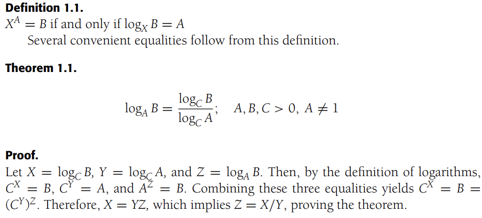

First they establish the variables that the logs equal to. Then they use the def of logs to create exponents. They create a relationship between them that says they are greater than 0. Then they replace the values of the original equation. The relationship is the same as the value of the top.

#### Logarithmns Def 2.2

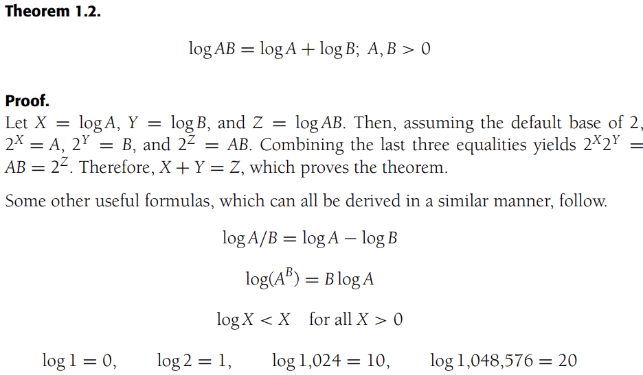

first they established the variables. then they used the definition of logs. After they created a relationship. This relationship proved the one above was true.

#### Series

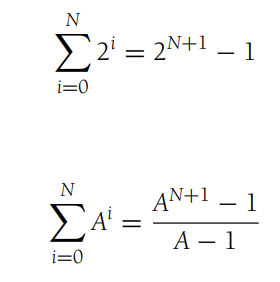

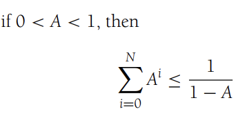

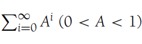

##### Geometric Series

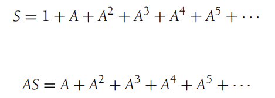

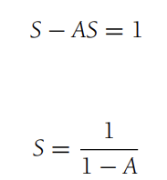

#### Arithmetic Series

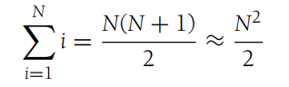

Equation 1

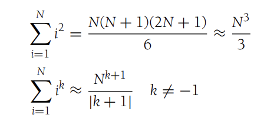

Equations 2 & 3 Uncommon

#### Euler's Constant

the result of this harmonic series is known as Eulers constant γ ≈ 0.57721566

Generic algebraic manipulations

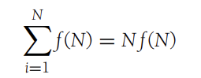

#### Modular Arithmetic

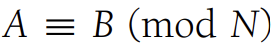

the three lines symbol means congruent

1. a and b have the same "remainder" when they are divided by n

n is a number greater than 1

2. a = k * n + b

3. n|(a-b)

| symbol means divides

(a-b) is a multiple of n

ex. 10 congruent 14(mod 4) 

this is true

1. 10/4 = 2R2 and 14/4 = 3R2
2. 10 = k * 4 + 14 thus k = -1
3. 4|(10-14) <=> 4|-4

Three Important Theorems

1. If N is prime,
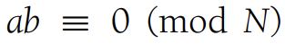
is true if and only if
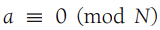
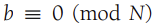

In other words, if a prime number N divides a product of two
numbers, it divides at least one of the two numbers.

2. If N is prime, the the equation 
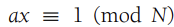

The unique solution is 
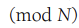
for all 0 < a < N
0 < x < N
the solution is the multiplicative inverse

3. If N is prime, 
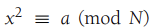

the equation has either two solutions

for all 0 < a < N or no solutions

#### The P Word

The best way to prove a theorem is false is through proof by induction and by contradiction.

##### Proof by Induction review

First step is proving the base case. The second step is the inductive hypothesis. This means the theorem is true is true for all cases up to some limit k.

## CH 2 Algorithmn Analysis

### 2.1 Mathematical Background

#### Def 2.1

T(N) = O(f(N)) if there are positive constants c and n_0 such that T(N) <= cf(N) when N >= n_0

#### Def 2.2

T()
