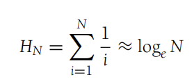

# DS & Algo Analysis in Java

## CH 1 Intro

### Mathematical Revieq

#### Logarithmns Def 2.1

First they establish the variables that the logs equal to. Then they use the def of logs to create exponents. They create a relationship between them that says they are greater than 0. Then they replace the values of the original equation. The relationship is the same as the value of the top.

#### Logarithmns Def 2.2

first they established the variables. then they used the definition of logs. After they created a relationship. This relationship proved the one above was true.

#### Series

##### Geometric Series

#### Arithmetic Series

Equation 1

Equations 2 & 3 Uncommon

#### Euler's Constant

the result of this harmonic series is known as Eulers constant γ ≈ 0.57721566

Generic algebraic manipulations

## CH 2 Algorithmn Analysis

### 2.1 Mathematical Background

#### Def 2.1

T(N) = O(f(N)) if there are positive constants c and n_0 such that T(N) <= cf(N) when N >= n_0

#### Def 2.2

T()
